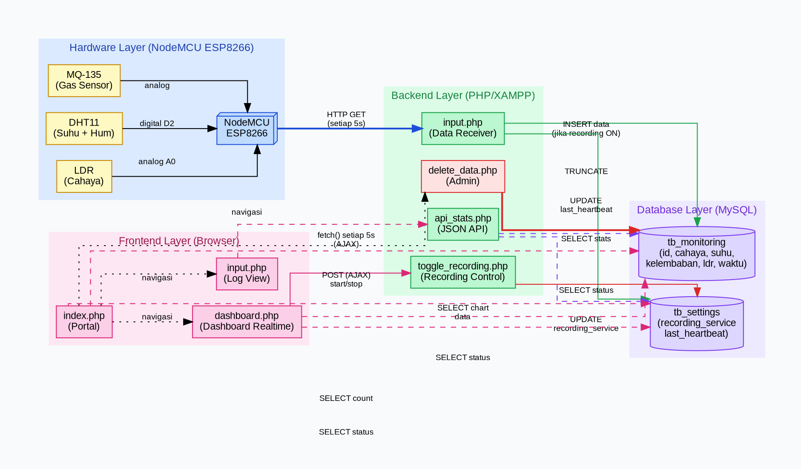
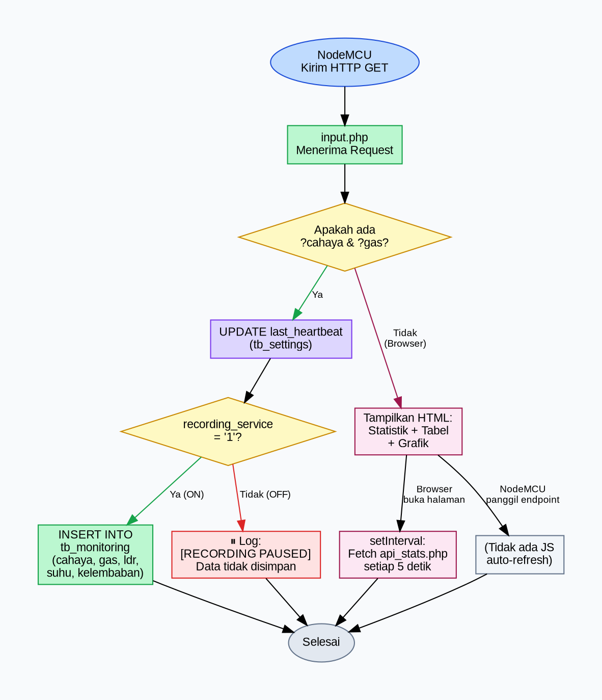
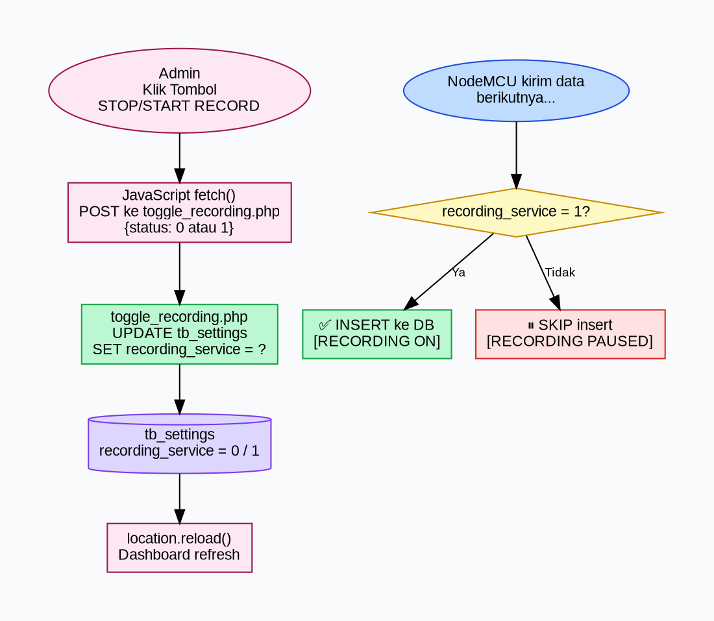
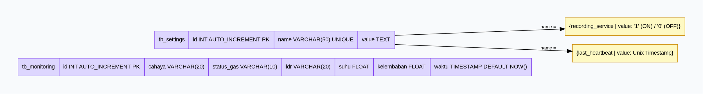

# Dokumentasi Teknis: Alur Kerja Sistem SensoLab

**Riset Instrumentasi Tahap 1 — Sensor Validation**  
Oleh : Vanya Clianta Evelyn Pasha

---

## Diagram 1 — Arsitektur Sistem Keseluruhan



---

## Diagram 2 — Alur Penerimaan Data (input.php)



---

## Diagram 3 — Alur Deteksi Status Hardware (Heartbeat)

```dot
digraph HeartbeatFlow {
    rankdir=LR;
    graph [fontname="Arial" bgcolor="#f8fafc" pad="0.5"];
    node  [fontname="Arial" fontsize=11 style=filled];
    edge  [fontname="Arial" fontsize=9];

    HW_ON  [label="NodeMCU\nMenyala" shape=oval fillcolor="#bfdbfe" color="#1d4ed8"];
    SEND   [label="Kirim data\nsetiap 5 detik" shape=box fillcolor="#bfdbfe" color="#1d4ed8"];
    HB_UPD [label="input.php\nUPDATE last_heartbeat\n= time()" shape=box fillcolor="#bbf7d0" color="#16a34a"];
    DB_HB  [label="tb_settings\nlast_heartbeat = T" shape=cylinder fillcolor="#ddd6fe" color="#7c3aed"];

    DASH_READ [label="dashboard.php / index.php\nSELECT last_heartbeat" shape=box fillcolor="#fce7f3" color="#9d174d"];
    CALC   [label="diff = time() - last_heartbeat" shape=box fillcolor="#fef9c3" color="#ca8a04"];
    CHK    [label="diff < 30 detik?" shape=diamond fillcolor="#fef9c3" color="#ca8a04"];
    ONLINE [label="✅ HARDWARE: ONLINE\n(Hijau + Pulse)" shape=box fillcolor="#bbf7d0" color="#16a34a"];
    OFFLINE [label="❌ HARDWARE: OFFLINE\n(Merah + Notifikasi)" shape=box fillcolor="#fee2e2" color="#dc2626"];

    HW_ON  -> SEND -> HB_UPD -> DB_HB;
    DB_HB  -> DASH_READ -> CALC -> CHK;
    CHK    -> ONLINE  [label="Ya"];
    CHK    -> OFFLINE [label="Tidak"];
}
```



---

## Diagram 4 — Alur Kontrol Perekaman



---

## Diagram 5 — Skema Database



---

## Ringkasan Alur Kerja

| No | Komponen | Fungsi | Interval |
|----|----------|--------|----------|
| 1 | NodeMCU (firmware) | Baca sensor → kirim HTTP GET | Setiap 5 detik |
| 2 | `input.php` | Terima data → update heartbeat → insert jika ON | Per request NodeMCU |
| 3 | `api_stats.php` | Kembalikan JSON statistik terkini | Per permintaan AJAX |
| 4 | `dashboard.php` | Tampilkan data real-time + kontrol | Auto-reload 5 detik |
| 5 | `toggle_recording.php` | ON/OFF perekaman database | Per klik admin |
| 6 | `delete_data.php` | TRUNCATE seluruh data | Per konfirmasi admin |
| 7 | `index.php` | Portal navigasi + status ringkas | Auto-reload 10 detik |

> Untuk merender diagram, gunakan [Graphviz Online](https://dreampuf.github.io/GraphvizOnline/) atau install Graphviz dan jalankan:
> ```bash
> dot -Tpng alur_sistem.dot -o alur_sistem.png
> ```
