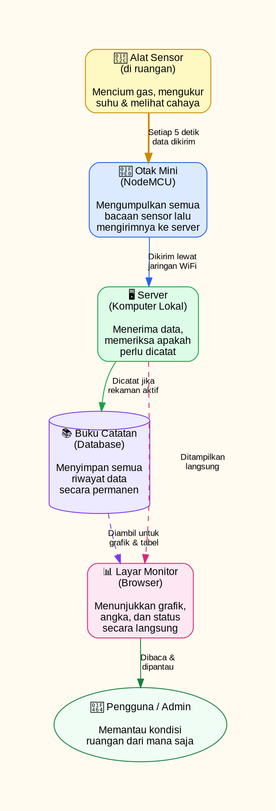
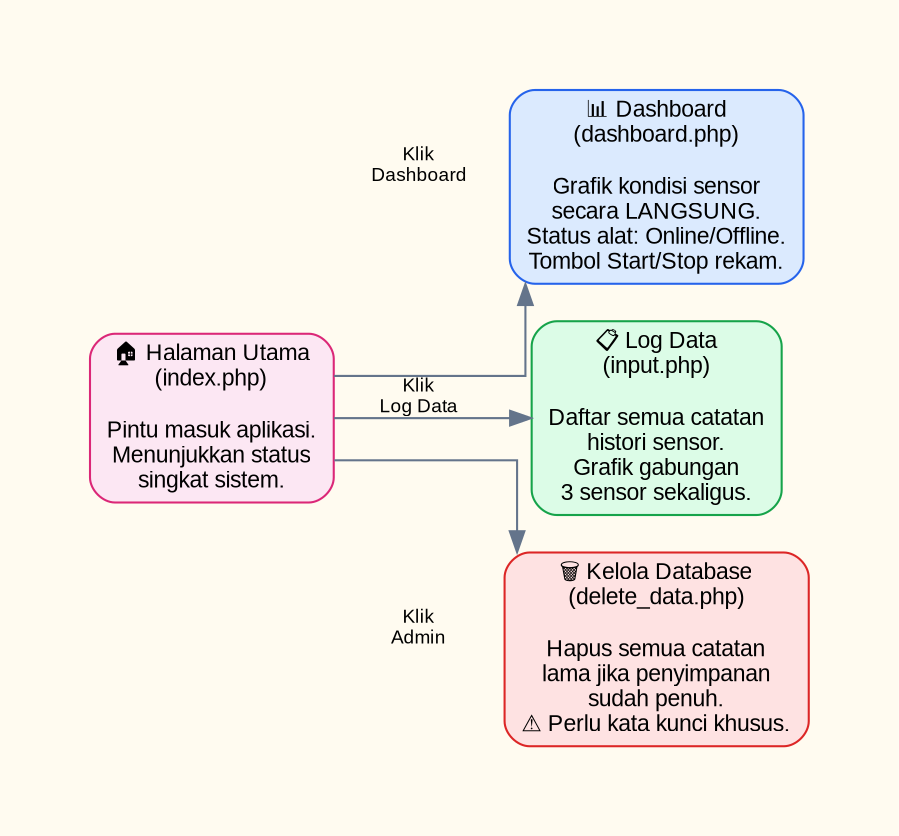
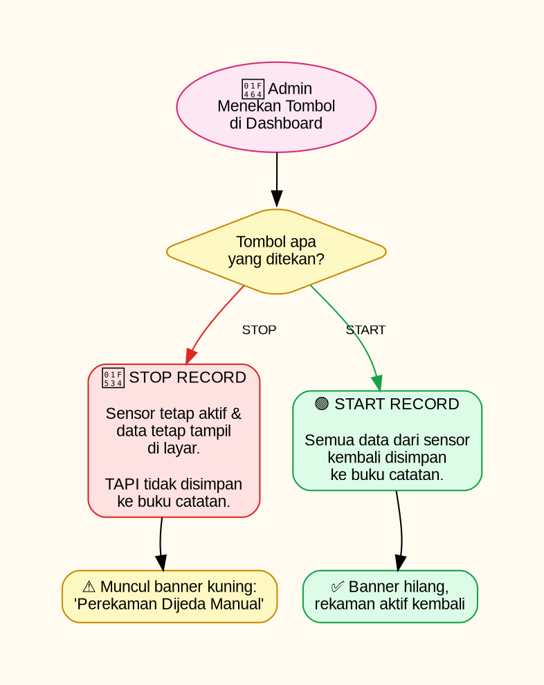
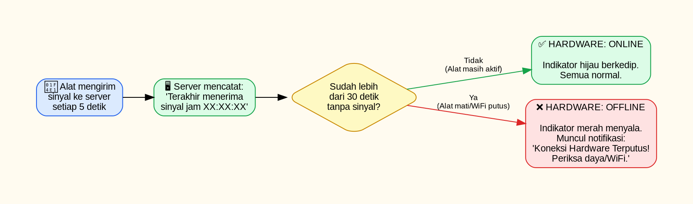
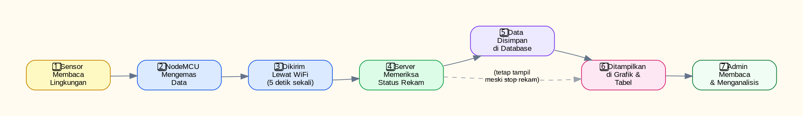

# SensoLab — Panduan Alur Sistem untuk Umum

**Riset Instrumentasi Tahap 1 — Sensor Validation**  
Oleh : Vanya Clianta Evelyn Pasha

> 📌 Dokumen ini menjelaskan cara kerja sistem secara sederhana,  
> **tanpa istilah teknis**, agar dapat dipahami oleh semua kalangan.

---

## 🌐 Gambaran Besar: Apa yang Dilakukan Sistem Ini?

Bayangkan sistem ini seperti **stasiun cuaca mini otomatis** yang:
- 👃 **Mencium** kadar gas di udara
- 🌡️ **Merasakan** suhu dan kelembaban ruangan
- 💡 **Melihat** apakah ruangan terang atau gelap
- 📊 **Mencatat** semua temuan itu ke dalam buku catatan digital
- 📱 **Melaporkan** hasilnya secara langsung lewat layar komputer Anda

---

## Diagram 1 — Alur Kerja Utama (Gambaran Besar)

---

## Diagram 2 — Apa yang Dilihat Pengguna di Layar?

---

## Diagram 3 — Fitur START / STOP Rekaman

---

## Diagram 4 — Sistem Mendeteksi Alat Mati/Nyala

---

## Diagram 5 — Siklus Hidup Data (Dari Udara ke Layar)

---

## 📖 Panduan Singkat: Apa yang Harus Dilakukan Pengguna?

### Pemantauan Harian
1. Buka browser → ketik alamat server
2. Halaman **Beranda** menampilkan status cepat alat dan jumlah data
3. Klik **Dashboard** untuk melihat kondisi sensor secara langsung

### Jika Ingin Berhenti Merekam (Misal: Saat Kalibrasi)
1. Buka **Dashboard**
2. Klik tombol merah **STOP RECORD** di pojok kanan atas
3. Muncul banner kuning → sensor tetap terpantau tapi data tidak dicatat
4. Klik **START RECORD** jika ingin merekam kembali

### Jika Database Sudah Penuh / Ingin Reset Data
1. Dari Beranda, klik **Kosongkan Database**
2. Baca peringatan dengan seksama
3. Ketik kata kunci konfirmasi: **`HAPUS_SEMUA_DATA_SEKARANG`**
4. Klik tombol hapus → semua riwayat data dihapus permanen

### Indikator Status yang Perlu Diperhatikan

| Indikator | Artinya | Tindakan |
|-----------|---------|----------|
| 🟢 HARDWARE: ONLINE | Alat berjalan normal | Tidak perlu tindakan |
| 🔴 HARDWARE: OFFLINE | Alat mati atau WiFi putus | Periksa kabel daya dan WiFi |
| 🟡 PEREKAMAN DIJEDA | Admin mematikan rekam manual | Klik START RECORD jika perlu |
| 🟢 STATUS: MEREKAM | Data aktif disimpan ke database | Normal |

---

*Dokumen ini dibuat untuk keperluan Riset Instrumentasi Tahap 1.*  
*SensoLab © 2026 — Vanya Clianta Evelyn Pasha*
